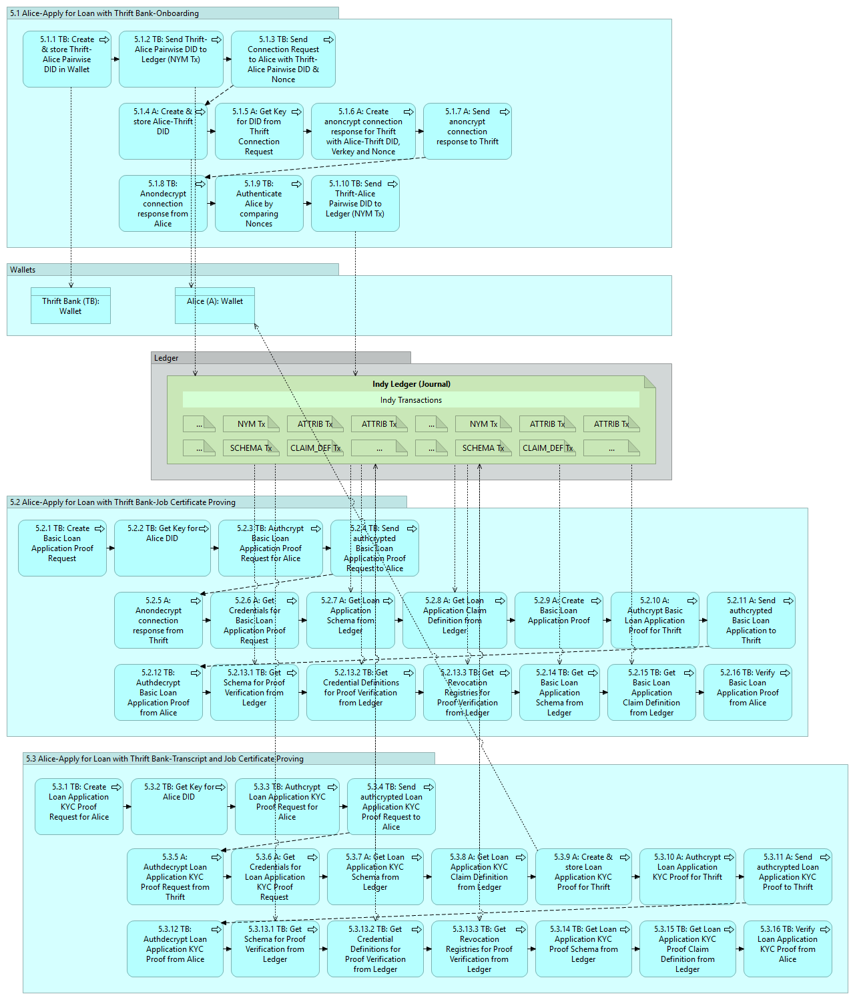

# INDY-DEV - 5.0 Raw Message Flows

This is a temporary page whose goal is to quickly illustrate the number and size of the JSON messages exchanged in a typical Indy SDK scenario.

The following documents, at a high-level, Activity 5, a subset of the tasks in the _Sally buys a car" Getting Started Scenario.

The message flows include all JSON messages exchanged between:
- Any pair of the 5 agents: 
    - Sovrin Steward (SS)
    - Government (G)
    - Faber College (FC)
    - Acme Corp (AC)
    - Thrift Bank (TB)
    - Alice (A)
- Any of the 5 agents and the interactions with their local wallet
- Any of the 5 agents and their interactions with their local, shared replica of the Ledger

## High-level Task Flow

Figure 1. High-Level Task Flow

## Message Flow

Figure 2. Interaction Diagram with Message Flows

## Sample Messages

| Message File | Size (Bytes) |
| ------------ | ------------:|
| [5.1.2&#32;SEND_NYM.txt](msgtraces/5.1.2&#32;SEND_NYM.txt) | 216|
| [5.1.3&#32;Connection&#32;Request.txt](msgtraces/5.1.3&#32;Connection&#32;Request.txt) | 92|
| [5.1.7&#32;Connection&#32;Response.txt](msgtraces/5.1.7&#32;Connection&#32;Response.txt) | 151|
| [5.1.9&#32;Decrypted&#32;Connection&#32;Response.txt](msgtraces/5.1.9&#32;Decrypted&#32;Connection&#32;Response.txt) | 161|
| [5.1.11&#32;SEND_NYM.txt](msgtraces/5.1.11&#32;SEND_NYM.txt) | 217|
| [5.2.1&#32;Loan&#32;Application-Basic&#32;Proof&#32;Request.txt](msgtraces/5.2.1&#32;Loan&#32;Application-Basic&#32;Proof&#32;Request.txt) | 595|
| [5.2.6&#32;GET_CRED_REFERENT.txt](msgtraces/5.2.6&#32;GET_CRED_REFERENT.txt) | 1181|
| [5.2.7&#32;GET_SCHEMA_REQ-Job-Certificate.txt](msgtraces/5.2.7&#32;GET_SCHEMA_REQ-Job-Certificate.txt) | 219|
| [5.2.7&#32;GET_SCHEMA_RESP-Job-Certificate.txt](msgtraces/5.2.7&#32;GET_SCHEMA_RESP-Job-Certificate.txt) | 2213|
| [5.2.8&#32;GET_CRED_DEF_REQ-Job-Certificate.txt](msgtraces/5.2.8&#32;GET_CRED_DEF_REQ-Job-Certificate.txt) | 217|
| [5.2.8&#32;GET_CRED_DEF_RESP-Job-Certificate.txt](msgtraces/5.2.8&#32;GET_CRED_DEF_RESP-Job-Certificate.txt) | 16607|
| [5.2.9&#32;Loan&#32;Application-Basic&#32;Proof.txt](msgtraces/5.2.9&#32;Loan&#32;Application-Basic&#32;Proof.txt) | 2120|
| [5.2.9&#32;Loan&#32;Application-Basic&#32;Requested&#32;Credentials.txt](msgtraces/5.2.9&#32;Loan&#32;Application-Basic&#32;Requested&#32;Credentials.txt) | 378|
| [5.2.14&#32;GET_SCHEMA_REQ-Job-Certificate.txt](msgtraces/5.2.14&#32;GET_SCHEMA_REQ-Job-Certificate.txt) | 220|
| [5.2.14&#32;GET_SCHEMA_RESP-Job-Certificate.txt](msgtraces/5.2.14&#32;GET_SCHEMA_RESP-Job-Certificate.txt) | 2214|
| [5.2.15&#32;GET_CRED_DEF_REQ-Job-Certificate.txt](msgtraces/5.2.15&#32;GET_CRED_DEF_REQ-Job-Certificate.txt) | 218|
| [5.2.15&#32;GET_CRED_DEF_RESP-Job-Certificate.txt](msgtraces/5.2.15&#32;GET_CRED_DEF_RESP-Job-Certificate.txt) | 16610|
| [5.3.1&#32;Loan&#32;Application-KYC&#32;Proof&#32;Request.txt](msgtraces/5.3.1&#32;Loan&#32;Application-KYC&#32;Proof&#32;Request.txt) | 289|
| [5.3.14&#32;GET_SCHEMA_REQ-Job-Certificate.txt](msgtraces/5.3.14&#32;GET_SCHEMA_REQ-Job-Certificate.txt) | 236|
| [5.3.6&#32;GET_CRED_REFERENT.txt](msgtraces/5.3.6&#32;GET_CRED_REFERENT.txt) | 1227|
| [5.3.7&#32;GET_SCHEMA_REQ-Job-Certificate.txt](msgtraces/5.3.7&#32;GET_SCHEMA_REQ-Job-Certificate.txt) | 235|
| [5.3.7&#32;GET_SCHEMA_REQ-Transcript.txt](msgtraces/5.3.7&#32;GET_SCHEMA_REQ-Transcript.txt) | 225|
| [5.3.7&#32;GET_SCHEMA_RESP-Job-Certificate.txt](msgtraces/5.3.7&#32;GET_SCHEMA_RESP-Job-Certificate.txt) | 2229|
| [5.3.7&#32;GET_SCHEMA_RESP-Transcript.txt](msgtraces/5.3.7&#32;GET_SCHEMA_RESP-Transcript.txt) | 2217|
| [5.3.8&#32;GET_CRED_DEF_REQ-Job-Certificate.txt](msgtraces/5.3.8&#32;GET_CRED_DEF_REQ-Job-Certificate.txt) | 233|
| [5.3.8&#32;GET_CRED_DEF_REQ-Transcript.txt](msgtraces/5.3.8&#32;GET_CRED_DEF_REQ-Transcript.txt) | 228|
| [5.3.8&#32;GET_CRED_DEF_RESP-Job-Certificate.txt](msgtraces/5.3.8&#32;GET_CRED_DEF_RESP-Job-Certificate.txt) | 16625|
| [5.3.8&#32;GET_CRED_DEF_RESP-Transcript.txt](msgtraces/5.3.8&#32;GET_CRED_DEF_RESP-Transcript.txt) | 19587|
| [5.3.9&#32;Loan&#32;Application-KYC&#32;Proof.txt](msgtraces/5.3.9&#32;Loan&#32;Application-KYC&#32;Proof.txt) | 8934|
| [5.3.9&#32;Loan&#32;Application-KYC&#32;Requested&#32;Credentials.txt](msgtraces/5.3.9&#32;Loan&#32;Application-KYC&#32;Requested&#32;Credentials.txt) | 403|
| [5.3.14&#32;GET_SCHEMA_REQ-Transcript.txt](msgtraces/5.3.14&#32;GET_SCHEMA_REQ-Transcript.txt) | 226|
| [5.3.14&#32;GET_SCHEMA_RESP-Job-Certificate.txt](msgtraces/5.3.14&#32;GET_SCHEMA_RESP-Job-Certificate.txt) | 2229|
| [5.3.14&#32;GET_SCHEMA_RESP-Transcript.txt](msgtraces/5.3.14&#32;GET_SCHEMA_RESP-Transcript.txt) | 2217|
| [5.3.15&#32;GET_CRED_DEF_REQ-Job-Certificate.txt](msgtraces/5.3.15&#32;GET_CRED_DEF_REQ-Job-Certificate.txt) | 234|
| [5.3.15&#32;GET_CRED_DEF_REQ-Transcript.txt](msgtraces/5.3.15&#32;GET_CRED_DEF_REQ-Transcript.txt) | 229|
| [5.3.15&#32;GET_CRED_DEF_RESP-Job-Certificate.txt](msgtraces/5.3.15&#32;GET_CRED_DEF_RESP-Job-Certificate.txt) | 16626|
| [5.3.15&#32;GET_CRED_DEF_RESP-Transcript.txt](msgtraces/5.3.15&#32;GET_CRED_DEF_RESP-Transcript.txt) | 19588|

Table 1. Message Files and Sizes (Bytes)

### Message Sizes

Figure 3. Message Sizes (Approximate)

## Appendix A - DID Legend

Figure 4. DID Legend
